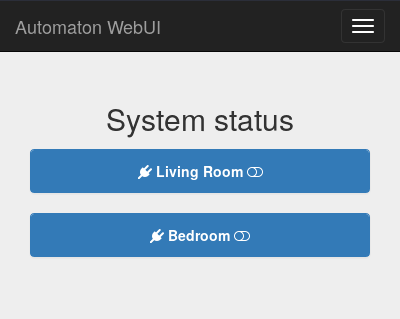
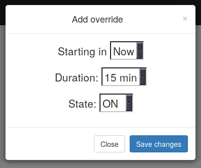
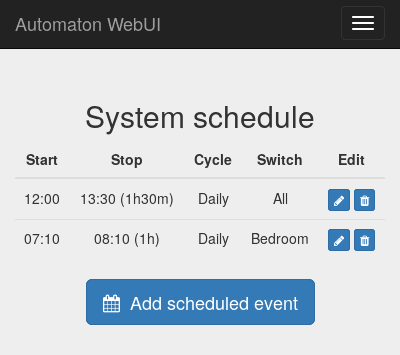

Home Automaton
==============

Small quick n' dirty project to set up a simple webservice to control devices
over internet according to a schedule.

The devices have to talk to a third party MQTT broker (I use mosquitto, cools
stuff really) and have a topic that can control them through simple "0" or "1"
values. In my case I use Itead S20 switches along with Xose Perez's firmware
for ESP8266, awesome stuff, check it out at bitbucket.org/xoseperez/espurna.
It should be compatible though with any MQTT controlable device, drop me an
issue if you cannot make it work.

Dependencies
------------

This project depends on my MQTT client (listed as submodule cause it's a very
simple code) and the C++ http server that can be found in my repo at
davidgfnet/cpp-http-server which I use for many projects. You will need to
checkout, build and install the later. It's a bit of a pain cause it depends
on gnutls and gcrypt even if SSL is disabled (will fix that at some point I
guess!). No more dependencies are needed really for now, which might change
in the future though.

How it works
------------

Just build the binary with a simple `make` (should work on POSIX OSes) provided
you have a decent C++11 compiler. Run the binary you get this way:

./automaton config.cfg schedule.sav

Where config.cfg should be a config file (see example.cfg) containing MQTT
settings and devices to control (it doesn't support dynamically adding devices
so far, sorry). The second argument is a scratch file where it will save any
saved settings across sessions. Useful if you reboot your machine or restart
the service to keep settings across restarts.

It is possible to customize the HTML template a bit by using the index.html
file. The template get embedded in the binary already pre-parsed for easy
processing by the C++ daemon.

Once up and running just navigate to the HTTP server interface and start adding
scheduled events to turn switches on at the right time. It is possible to add
the so called overrides, which are one-time scheduled events that can override
scheduled events. This is useful to patch your usual schedule in the event of
changes in your routine.

Notes
-----

The granularity of the scheduling is minutes, although the scheduler usually
runs every 5 seconds or so. Do not expect it to be fast, it was thought to
control heating devices and thus no need to rush. It could theoretically do
PWM to control a bit the intensity of the heating, but it should use a pretty
big period for it (in the order of minutes), and still it might kill your
relay.

Screenshots
-----------

